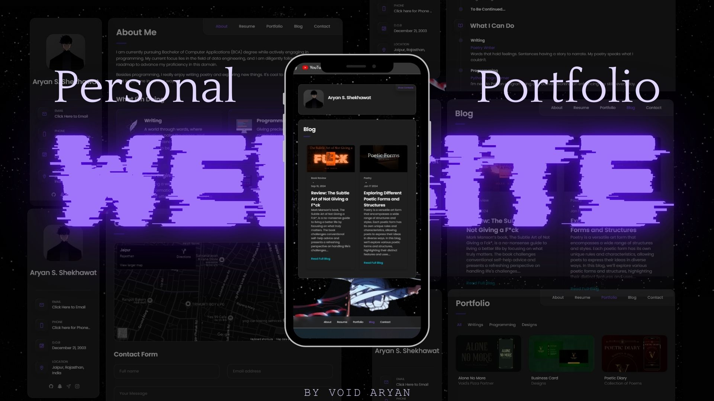
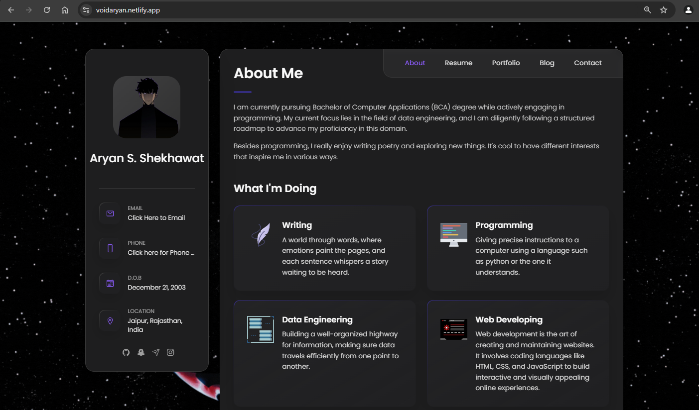
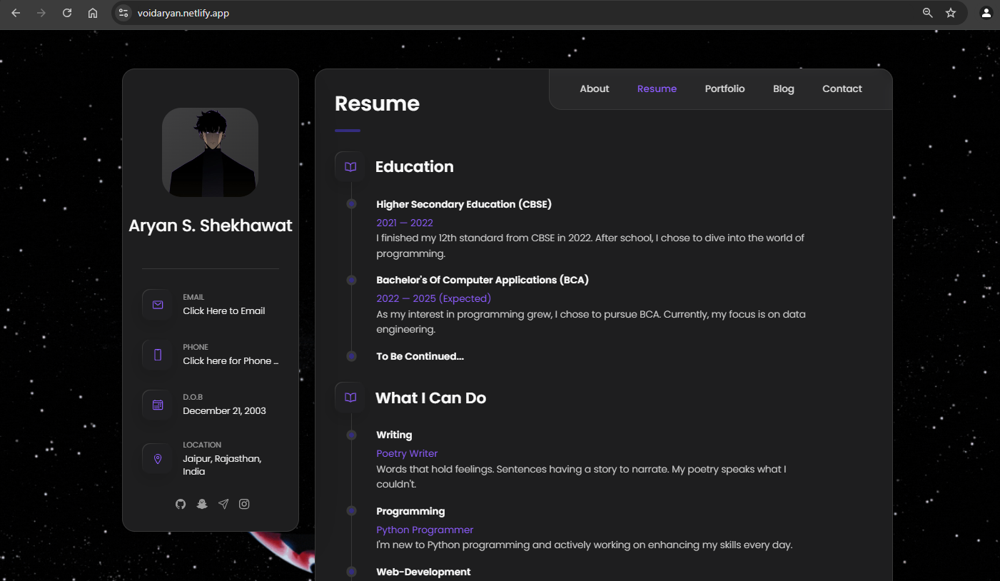
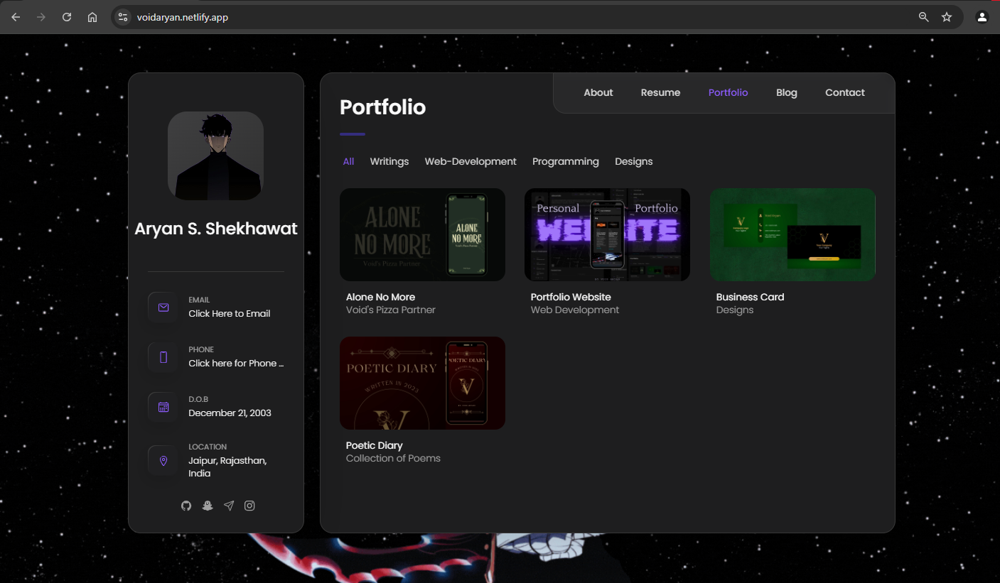
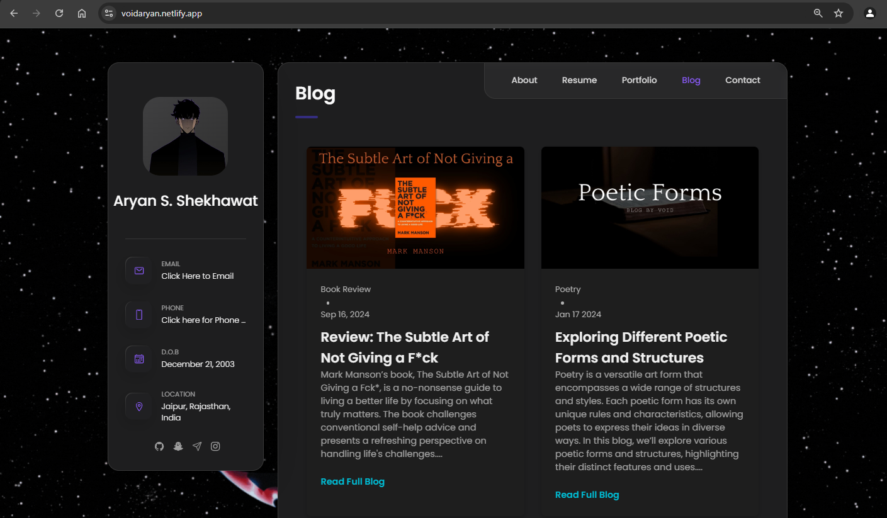
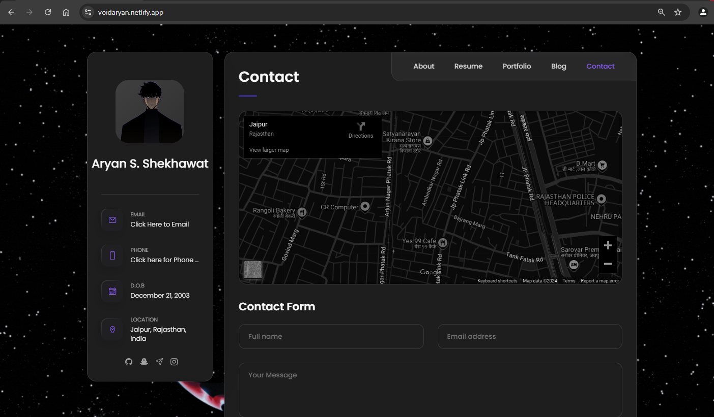

# Personal Portfolio 🔥
> https://VoidAryan.netlify.app/

:star: Star me on GitHub — it helps!

### Website Preview 

#### Home Page / About

#### Resume

#### Portfolio

#### Blog

#### Contact Form

  

:star: Star me on GitHub — it helps!

## Features 📋
⚡️ Cool Dark Theme Website\
⚡️ Multiple WebPages\
⚡️ Stable Personal Portfolio Website\
⚡️ Additional Blog Page\
⚡️ Contact Form\
⚡️ Easy to modify

## Installation & Deployment 📦
- Clone the repository and modify the content of <b>index.html</b> 
- Add or remove images from `assets/imgages/` directory as per your requirement.
- Use [Github Pages](https://create-react-app.dev/docs/deployment/#github-pages) to create your own website.
- To deploy your website, first you need to create github repository with name `<your-github-username>.github.io` and push the generated code to the `master` branch.

## Sections 📚
✔️ Home Page - About\
✔️ Education\
✔️ Projects \
✔️ Skills \
✔️ Resume\
✔️ Contact Info\
✔️ Blog\
✔️ Contact Form

## Contributing 💡
#### Step 1

- **Option 1**
    - 🍴 Fork this repo!

- **Option 2**
    - 👯 Clone this repo to your local machine.

#### Step 2

- **Build your code** 🔨🔨🔨

#### Step 3

- 🔃 Create a new pull request.
